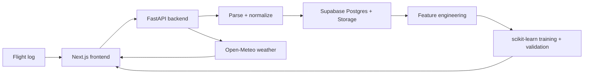

# AeroStats AI

[Live Website](https://aerostats-ai.vercel.app) | [LinkedIn](https://www.linkedin.com/in/immanuelgnanaseelan/)

AeroStats AI is my personal drone telemetry and machine-learning portfolio project. It turns supported flight logs into replayable routes, performance analysis, weather-aware context, and ML models that improve as my flight history grows.

The project starts honestly with no preloaded flights, fabricated metrics, or fake confidence labels. Real results appear only after telemetry is imported and the validation requirements are met.

## About

I built AeroStats AI to demonstrate a complete data and ML workflow around real drone flights:

- Ingest and normalize flight telemetry
- Persist private flight data and model artifacts
- Replay routes with synchronized charts and event markers
- Compare battery drain, speed, altitude, signal quality, and route efficiency
- Join historical and forecast weather using GPS and timestamps
- Train and validate battery, risk, and anomaly models
- Explain prediction confidence and limitations

## Core Views

- **Dashboard:** an overview of the entire flight history, totals, efficiency trends, risk distribution, and recent flights.
- **Flights:** the searchable library of individual flights. Each flight opens into the detailed replay and telemetry experience.
- **Forecast:** future weather windows ranked using location, weather conditions, past flight patterns, and trained models when available.
- **Model:** training status, validation evidence, predictions, confidence, feature importance, and anomaly results.

## Architecture

## Tech Stack

- Next.js, TypeScript, Tailwind CSS
- FastAPI, pandas, NumPy, scikit-learn
- Supabase Postgres and private Storage
- Leaflet and Recharts
- Open-Meteo
- Vercel and Render

## ML Pipeline

AeroStats AI includes:

- Battery drain regression
- Segment-level battery analysis
- Weakly supervised flight-risk classification
- Isolation Forest anomaly detection
- Weather-aware flight-window ranking

The app does not claim high confidence without sufficient flight count, usable telemetry, feature completeness, held-out validation, and acceptable uncertainty.

## Privacy And Safety

Flight logs can expose sensitive GPS locations. Uploaded data is private, service-role credentials remain backend-only, executable uploads are rejected, and private flight files are excluded from Git.

AeroStats AI provides decision-support estimates only. It does not guarantee flight safety. Always follow local drone regulations, official airspace guidance, visual-line-of-sight requirements, and weather advisories.

## DJI Flight Log Support

CSV and JSON telemetry are supported today. DJI Fly TXT and FlightRecords ZIP decoding will be finalized and tested against an original iPhone DJI Fly export after the first flight.

DJI and DJI Fly are trademarks of DJI. AeroStats AI is independent and is not affiliated with or endorsed by DJI.

## Future Improvements

- Verified DJI Fly iPhone log decoding
- Durable model-artifact rehydration after backend cold starts
- Expanded model evaluation and calibration views
- Coordinate anonymization controls for portfolio screenshots

## License

Copyright (c) 2026 Immanuel Gnanaseelan. All rights reserved.

This repository is source-available for portfolio review only. No permission is granted to copy, modify, distribute, sublicense, or reuse the code, design, branding, or assets without prior written permission.
