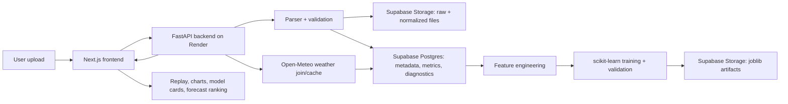

# AeroStats AI

AeroStats AI is a full-stack, upload-first drone telemetry analytics and ML platform for DJI-style flight logs, especially future DJI Mavic Mini 1 exports from the DJI Fly app.

It starts empty. There are no preloaded demo flights, no hard-coded fake routes, no fake dashboard metrics, and no fake confidence labels. Users upload CSV/JSON test files first, then the backend parses telemetry, stores flight artifacts in Supabase, joins weather from Open-Meteo by GPS/time, builds segment-level feature vectors, trains scikit-learn models, and powers the replay/dashboard/model/forecast UI.

Portfolio bullet:

> Built AeroStats AI, a full-stack drone telemetry analytics and ML platform that stores uploaded flight logs in Supabase, processes telemetry with a FastAPI backend, trains scikit-learn models on segment-level flight features, joins Open-Meteo weather by GPS/time, and predicts battery drain, flight risk, anomalies, and optimal flight windows with explainable confidence scores.

## Why I Built It

Drone telemetry contains GPS, speed, altitude, battery, signal, and timing patterns that are useful for flight review and decision support. AeroStats AI treats that data seriously: it parses user uploads, avoids fake preloaded metrics, and uses a real backend ML pipeline instead of a cosmetic AI dashboard.

## Architecture



## Tech Stack

Frontend:

- Next.js App Router
- TypeScript
- Tailwind CSS
- Leaflet / react-leaflet
- Recharts
- Vercel free tier

Backend:

- FastAPI
- pandas
- NumPy
- scikit-learn
- pydantic
- joblib
- python-multipart
- uvicorn
- Supabase Python client
- Render free web service

Storage and data:

- Supabase Postgres for structured summaries, metrics, feature vectors, diagnostics, model runs, predictions, and weather cache
- Supabase Storage for raw uploads, normalized full telemetry, and model artifacts
- Open-Meteo free API for weather

## Free-Tier Deployment Plan

- Frontend: Vercel free tier
- Backend: Render free web service
- Database/storage: Supabase free plan
- Weather: Open-Meteo free API
- Maps: Leaflet with OpenStreetMap tiles
- No Google Maps
- No OpenAI API
- No paid ML hosting
- Training is user-triggered to avoid always-on compute
- Render free services can cold-start; the frontend shows backend status and “Backend waking up” messaging

## Local Setup

Frontend:

```bash
npm install
npm run dev
```

Backend:

```bash
cd backend
py -m venv .venv
.venv\Scripts\activate
pip install -r requirements.txt
uvicorn app.main:app --reload --port 8000
```

Set frontend env in `.env.local`:

```bash
NEXT_PUBLIC_API_BASE_URL=http://localhost:8000
NEXT_PUBLIC_SUPABASE_URL=your_supabase_url
NEXT_PUBLIC_SUPABASE_ANON_KEY=your_anon_key
```

Set backend env in `backend/.env`:

```bash
SUPABASE_URL=your_supabase_url
SUPABASE_SERVICE_ROLE_KEY=your_service_role_key
SUPABASE_STORAGE_BUCKET=aerostats-flight-files
MODEL_ARTIFACT_BUCKET=aerostats-model-artifacts
OPEN_METEO_BASE_URL=https://api.open-meteo.com/v1
CORS_ORIGINS=http://localhost:3000,https://aerostats-ai.vercel.app
MAX_UPLOAD_MB=15
```

Important: never put `SUPABASE_SERVICE_ROLE_KEY` in frontend env variables.

## Supabase Setup

I cannot safely create the database inside your `ignanaseelan04@gmail.com` Supabase account from this environment because that requires account/session access. Use these steps:

1. Log in to Supabase with `ignanaseelan04@gmail.com`.
2. Create a new project, for example `aerostats-ai`.
3. Open SQL Editor.
4. Paste and run the full SQL from:
   `supabase/migrations/001_initial_schema.sql`
5. Go to Project Settings, API.
6. Copy `Project URL` to `SUPABASE_URL` and `NEXT_PUBLIC_SUPABASE_URL`.
7. Copy `anon public` to `NEXT_PUBLIC_SUPABASE_ANON_KEY`.
8. Copy `service_role` only to Render backend env as `SUPABASE_SERVICE_ROLE_KEY`.

The migration creates:

- `flights`
- `telemetry_points`
- `flight_metrics`
- `weather_snapshots`
- `feature_vectors`
- `model_runs`
- `predictions`
- `parser_diagnostics`
- `weather_cache`
- Private storage buckets:
  - `aerostats-flight-files`
  - `aerostats-model-artifacts`

RLS is enabled and no anonymous table policies are created. This keeps uploaded GPS data private by default and routes privileged operations through the backend service role.

## Render Backend Setup

1. Push the repo to GitHub.
2. Create a Render Web Service.
3. Root directory: `backend`
4. Build command: `pip install -r requirements.txt`
5. Start command: `uvicorn app.main:app --host 0.0.0.0 --port $PORT`
6. Add backend environment variables from `backend/.env.example`.
7. After deploy, copy the Render URL.
8. Set Vercel `NEXT_PUBLIC_API_BASE_URL` to the Render URL.

The included `render.yaml` can also be used as a Render blueprint.

## Vercel Frontend Setup

Set these environment variables in Vercel:

```bash
NEXT_PUBLIC_API_BASE_URL=https://your-render-service.onrender.com
NEXT_PUBLIC_SUPABASE_URL=your_supabase_url
NEXT_PUBLIC_SUPABASE_ANON_KEY=your_supabase_anon_key
```

Do not add `SUPABASE_SERVICE_ROLE_KEY` to Vercel.

## Parser Pipeline

Accepted formats:

- `.csv`
- `.json`
- `.txt`
- `.zip`

Implemented backend parser functions:

- `detect_file_type`
- `parse_uploaded_flight_file`
- `parse_flight_csv`
- `parse_flight_json`
- `parse_dji_flight_record`
- `parse_dji_flightrecords_zip`
- `normalize_telemetry`
- `validate_flight_record`
- `derive_flight_metrics`
- `extract_flight_metadata`
- `split_into_flights`
- `downsample_telemetry_for_replay`
- `generate_flight_events`
- `generate_flight_tags`

CSV and JSON work with AeroStats AI’s internal schema. DJI TXT/ZIP support is scaffolded honestly: the backend returns parser diagnostics instead of pretending unsupported DJI records were parsed.

Minimum fields:

- `timestamp`
- `latitude`
- `longitude`

Recommended fields:

- `altitudeMeters`
- `speedMps`
- `batteryPercent`
- `distanceFromHomeMeters`
- `headingDegrees`
- `verticalSpeedMps`
- `gpsSatellites`
- `signalStrengthPercent`
- `eventType`

## Weather Pipeline

Weather is not assumed to be inside DJI logs. The backend joins it separately:

- Extract timestamp, latitude, and longitude
- Request historical weather from Open-Meteo for uploaded flights
- Request forecast windows for future planning
- Cache weather by lat/lon/time range
- Join closest weather snapshot to telemetry timestamps

Attribution: Weather data provided by Open-Meteo.

## ML Pipeline

The backend implements real scikit-learn models. The ML combines uploaded drone telemetry plus weather when available.

Models:

1. Battery Drain Regressor
   - Ridge
   - RandomForestRegressor
   - ExtraTreesRegressor
   - HistGradientBoostingRegressor when enough data exists

2. Segment-Level Battery Drain Model
   - Splits flights into time windows
   - Uses segment duration, distance, altitude delta, speed variance, acceleration proxy, hover ratio, GPS/signal, battery delta, and weather

3. Flight Risk Classifier
   - LogisticRegression
   - RandomForestClassifier
   - ExtraTreesClassifier
   - Weakly supervised until real human risk labels exist

4. Anomaly Detector
   - IsolationForest
   - Returns anomaly time ranges, scores, type guesses, and explanations

5. Best Flight Window Ranker
   - Uses forecast weather, user flight profile, trained battery/risk models when available, and conservative fallback scoring

## Validation Strategy

The backend avoids segment leakage:

- Uses GroupKFold by `flight_id` when at least 3 flights exist
- Uses leave-one-flight-out when practical
- Uses time-block validation for one-flight datasets and marks confidence low
- Does not randomly split same-flight segments without warning

Metrics include:

- MAE
- RMSE
- R²
- Median absolute error
- Prediction interval width
- Accuracy
- Balanced accuracy
- F1 score
- Confusion matrix

## Confidence Scoring

Confidence labels:

- Not available
- Low
- Medium
- High

High confidence requires multiple flights, enough segment rows, strong feature completeness, validation support, and narrow uncertainty. The UI does not show “High confidence” just because a model returned a number.

Confidence considers:

- Number of flights
- Segment rows
- Feature completeness
- Validation metrics
- Prediction interval width
- Weather availability
- Out-of-distribution checks

## Weak-Label Risk Classifier

Until human risk labels exist, the backend creates transparent weak labels from:

- High wind/gusts
- Low return margin
- Low signal/GPS quality
- Unusual battery drain
- Far distance from home
- High speed variation
- Sudden altitude changes

The UI and model runs mark this as weakly supervised.

## Privacy And GPS Safety

Drone logs can contain sensitive home/location data.

Security and privacy controls:

- Uploaded logs are not public
- Supabase tables have RLS enabled
- No anonymous table policies are created
- Frontend never receives the Supabase service role key
- Backend validates extension and upload size
- Suspicious executable/script file types are rejected
- Uploaded content is never executed
- Raw files, private data, CSV/JSON/TXT/ZIP logs, and env files are ignored by Git
- Delete flight API is available
- Settings page includes export controls

`.gitignore` includes:

- `/uploads`
- `/data/raw`
- `/data/private`
- `*.zip`
- `*.csv`
- `*.json`
- `*.txt`
- `.env`
- `.env.local`

Project config JSON files are explicitly unignored so the app remains buildable.

## API Routes

Health:

- `GET /health`
- `GET /model/status`

Upload/parse:

- `POST /upload/flight`
- `POST /parse/file`
- `POST /parse/dji-flightrecords-zip`

Flights:

- `GET /flights`
- `GET /flights/{flight_id}`
- `DELETE /flights/{flight_id}`

Telemetry:

- `GET /flights/{flight_id}/telemetry`
- `GET /flights/{flight_id}/telemetry/downsampled`

Features:

- `POST /features/extract/{flight_id}`
- `GET /features/{flight_id}`
- `POST /features/build-dataset`

Weather:

- `POST /weather/join/{flight_id}`
- `GET /weather/forecast?lat={lat}&lon={lon}`
- `GET /weather/status`

ML:

- `POST /ml/train`
- `POST /ml/train/battery`
- `POST /ml/train/risk`
- `POST /ml/train/anomaly`
- `POST /ml/predict/battery`
- `POST /ml/predict/risk`
- `POST /ml/anomalies/{flight_id}`
- `POST /ml/rank-flight-windows`
- `GET /ml/model-runs`
- `GET /ml/model-runs/{model_run_id}`
- `GET /ml/explain/{prediction_id}`
- `GET /ml/confidence-report`

## DJI Fly FlightRecords Future Support

Planned workflow:

1. Fly DJI Mavic Mini 1 using DJI Fly.
2. Export the DJI Fly `FlightRecords` folder from iPhone.
3. Compress the folder into a `.zip`.
4. Upload the `.zip` to AeroStats AI.
5. Detect file type.
6. Extract DJI records.
7. Normalize telemetry into the AeroStats AI schema.
8. Join weather separately by GPS/time.
9. Extract features.
10. Train or update ML models.
11. Display replay, charts, predictions, confidence, and insights.

## Screenshots

Add after uploading real or synthetic personal test telemetry:

- Landing page
- Upload diagnostics
- Empty dashboard
- Populated dashboard
- Flight replay page
- Model cards
- Forecast ranking
- Settings diagnostics

## Demo Video

Placeholder: record a short walkthrough showing upload, parser diagnostics, replay, weather join, training, and forecast ranking.

## Future Improvements

- Full DJI Fly FlightRecords field mapping
- Auth and per-user row ownership
- Coordinate anonymization UI with persisted shifted exports
- Durable model artifact rehydration from Supabase on cold start
- More complete backend-to-frontend replacement of local fallback state
- Background training queue if a free-tier-friendly queue is added later
- More robust CSV dialect detection
- Full model cards with calibration plots

## Disclaimer

AeroStats AI provides decision-support estimates based on uploaded telemetry and weather data. It does not guarantee flight safety. Always follow local drone regulations, check official airspace tools, maintain visual line of sight, and use your own judgment before flying.
